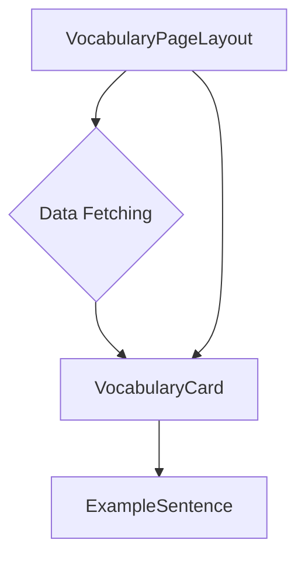

# Architectural Plan: Vocabulary Pages Refactor (Final)

This document outlines the architectural blueprint for refactoring the Madinah application's vocabulary pages. This plan focuses on the core component restructuring, leveraging the **existing data schema** and ensuring visual consistency with the rest of the site.

---

## 1. Data Interface: `VocabularyItem`

We will use the **existing** `VocabularyItem` interface defined in `src/data/vocab/vocab.ts` **without any changes**. This ensures maximum stability and avoids any data-related work.

---

## 2. Component Architecture

The UI will be broken down into modular, reusable components that work directly with the existing data structure.

### `VocabularyPageLayout`
*   **Purpose:** The top-level container for a vocabulary page. It handles the overall page structure, including the title and the grid of vocabulary cards.
*   **Props:**
    *   `title: string`: The title of the vocabulary set (e.g., "Lesson 1 Vocabulary").
    *   `items: VocabularyItem[]`: An array of vocabulary items using the **existing** `VocabularyItem` interface.

### `VocabularyCard`
*   **Purpose:** To display a single vocabulary item from the existing data structure.
*   **Props:**
    *   `item: VocabularyItem`: The full vocabulary item object from `src/data/vocab/vocab.ts`.
*   **Contains:**
    *   Displays `item.word`, `item.translation.en`, and `item.definition`.
    *   Maps over the `item.examples` array and renders an `ExampleSentence` component for each one.

### `ExampleSentence`
*   **Purpose:** To display a single example sentence, showing both Arabic and English versions.
*   **Props:**
    *   `example: Example`: An object from the `item.examples` array, containing `{ arabic: string; english: string; }`.

---

## 3. Data Fetching Strategy

**Recommendation:** Use `getStaticProps` with `getStaticPaths`.

This recommendation remains unchanged. The vocabulary data is static and stored locally, making static generation the most performant and efficient choice.

### Justification:

1.  **Performance:** Pre-rendering pages at build time results in the fastest possible load times.
2.  **Data Freshness:** The data is fetched once at build time, which is ideal for static content.
3.  **Reduced Server Load:** Eliminates the need for server-side computation on each request.

---

## 4. UI/UX Consistency

To ensure the new vocabulary pages feel integrated with the rest of the application, the `VocabularyPageLayout` component should be built within the existing site-wide layout structure. It should reuse shared components like the `Header` and `Sidebar` from `src/components/layout/` and adhere to the established styling and design patterns defined in `src/app/globals.css`. This will prevent the new pages from looking disconnected.

---

## 5. Future Enhancements

The following features have been deferred to keep the initial refactor focused. They can be added in future updates by extending the `VocabularyItem` interface and creating new components.

*   **Audio Player:** An `AudioPlayer` component could be added to play pronunciation audio. This would require adding a `pronunciation_audio_url` field to the `VocabularyItem` interface.
*   **Image Display:** The `VocabularyCard` could be enhanced to display a relevant image. This would require adding an `image_url` field to the `VocabularyItem` interface.