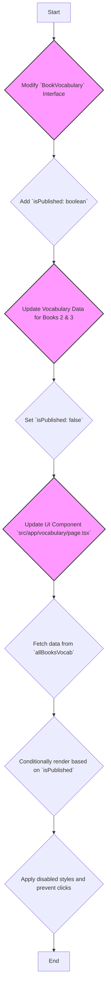

# Vocabulary Schema Modification and Implementation Plan

This document outlines the plan to modify the vocabulary data structure to support a "coming soon" or "disabled" state for vocabulary books.

### 1. Analysis of the Data Structure

*   **Vocabulary Schema:** The primary interface for vocabulary data is `BookVocabulary`, defined in `src/data/vocab/vocab.ts`. This interface defines the shape of vocabulary data for each book.
*   **Vocabulary Data:** The main collection of vocabulary books is `allBooksVocab` in `src/data/vocab/index.ts`. This object maps book IDs to their corresponding `BookVocabulary` data.
*   **UI Rendering:** The vocabulary landing page, `src/app/vocabulary/page.tsx`, currently uses `getAvailableBooks()` from `src/data/books.ts` to fetch the list of books. This function is tied to the availability of *lessons*, not vocabulary.

### 2. Proposed Schema Change

I propose adding a new optional property, `isPublished`, to the `BookVocabulary` interface in `src/data/vocab/vocab.ts`.

```typescript
// In src/data/vocab/vocab.ts

export interface BookVocabulary {
  bookId: string;
  title: {
    ar: string;
    en: string;
  };
  description?: {
    ar?: string;
    en?: string;
  };
  isPublished?: boolean; // New property
  vocabularyLists?: VocabularyList[];
  vocabularyItems?: VocabularyItem[];
}
```

**Justification:**

*   **Clarity and Intent:** The name `isPublished` clearly communicates the purpose of the property.
*   **Optionality:** Making it optional (`?`) ensures backward compatibility. Existing book data that lacks this property can be treated as published by default (`isPublished ?? true`), preventing breaking changes.
*   **Simplicity:** A boolean flag is the simplest and most effective way to represent a binary "on/off" or "enabled/disabled" state.

### 3. Plan for Implementation

Here is a step-by-step plan to implement the "coming soon" feature for vocabulary books.



**Step-by-Step Guide:**

1.  **Update TypeScript Interface:**
    *   **File:** `src/data/vocab/vocab.ts`
    *   **Action:** Add the `isPublished?: boolean;` property to the `BookVocabulary` interface as described above.

2.  **Update Vocabulary Data Files:**
    *   **Files:** Locate the data definitions for Book 2 and Book 3 (`src/data/vocab/book2/main.ts` and `src/data/vocab/book3/main.ts`).
    *   **Action:** In each of these files, add the property `isPublished: false` to the main exported object (`madinahBook2` and `madinahBook3`).
    *   **File:** `src/data/vocab/index.ts`
    *   **Action:** Uncomment the lines that import and include `madinahBook2` and `madinahBook3` in the `allBooksVocab` object.

3.  **Refactor UI Component:**
    *   **File:** `src/app/vocabulary/page.tsx`
    *   **Action:**
        1.  Change the data source. Instead of calling `getAvailableBooks()`, import `allBooksVocab` from `src/data/vocab/index.ts` and use `Object.values(allBooksVocab)` to get the array of books.
        2.  Inside the `map` function, check the `isPublished` property for each book.
        3.  **Conditional Rendering:**
            *   If `book.isPublished` is `false` (or undefined, which we'll treat as `true`), wrap the `Card` in a `Link` component as it is now.
            *   If `book.isPublished` is `false`, render the `Card` without a `Link`. Apply disabled styles (e.g., `opacity-50 cursor-not-allowed`) and add a "Coming Soon" badge to the `CardHeader`.